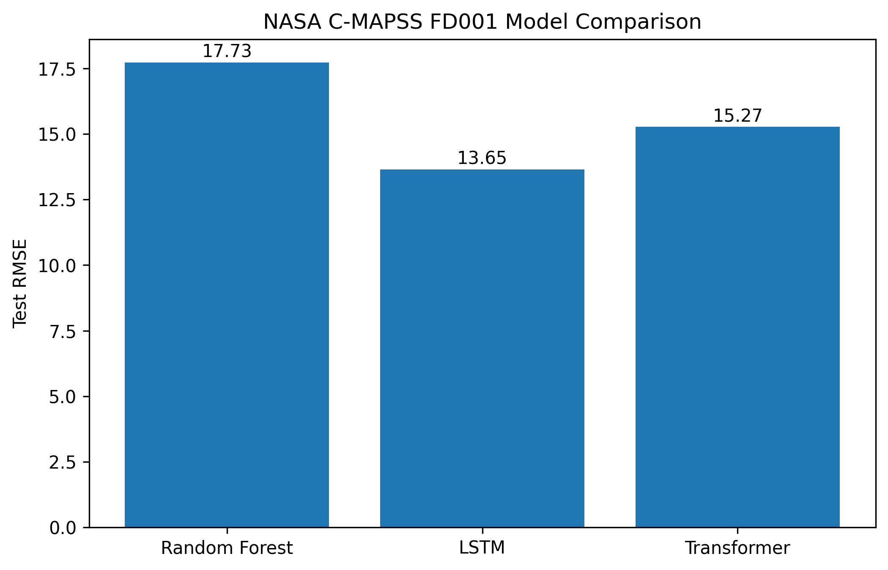
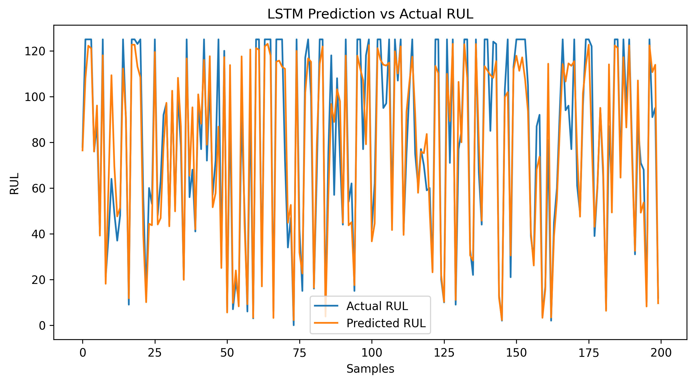
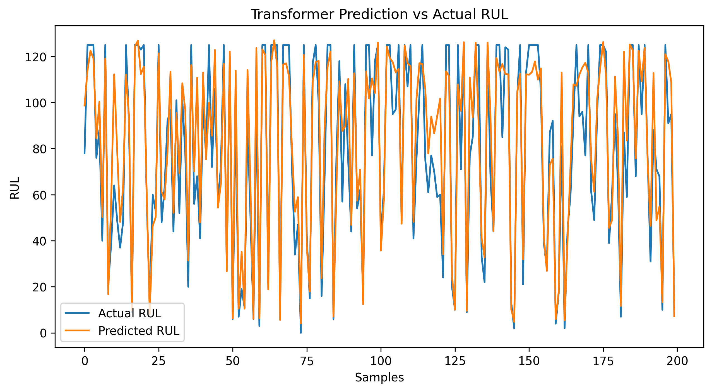

# 🚀 Predictive Maintenance using Deep Learning

## Overview

This project predicts the **Remaining Useful Life (RUL)** of aircraft turbofan engines using sensor data from NASA's C-MAPSS dataset.

Predictive maintenance helps industries reduce downtime, lower maintenance costs, and prevent unexpected equipment failures by estimating when a machine is likely to fail.

The project explores and compares:

* Random Forest Regressor (Baseline)
* Long Short-Term Memory (LSTM)
* Transformer Network

and deploys the best-performing model through an interactive Streamlit application.

---

## Problem Statement

Aircraft engines generate large amounts of sensor data during operation.

The objective is to estimate:

> How many operational cycles remain before an engine fails?

This task is known as **Remaining Useful Life (RUL) Prediction** and is a core problem in Predictive Maintenance.

---

## Dataset

NASA C-MAPSS Turbofan Engine Degradation Dataset

Dataset Characteristics:

* Multiple engines
* Multivariate sensor measurements
* Engine operating settings
* Complete run-to-failure trajectories

Dataset Used:

* FD001 subset

Features:

* Operational Settings
* Sensor Measurements
* Engine ID
* Operational Cycle

Target:

* Remaining Useful Life (RUL)

---

## Project Pipeline

```text
Raw Sensor Data
       │
       ▼
Data Understanding
       │
       ▼
Feature Selection
       │
       ▼
RUL Generation
       │
       ▼
Normalization
       │
       ▼
Sequence Creation
       │
       ▼
Random Forest Baseline
       │
       ▼
LSTM Model
       │
       ▼
Transformer Model
       │
       ▼
Model Evaluation
       │
       ▼
Streamlit Deployment
```

---

## Data Preprocessing

The following preprocessing steps were applied:

### 1. Sensor Selection

Sensors with little or no variance were removed:

```python
setting_3
sensor_1
sensor_5
sensor_6
sensor_10
sensor_16
sensor_18
sensor_19
```

### 2. RUL Target Generation

For each engine:

```text
RUL = Maximum Cycle - Current Cycle
```

The target was capped at:

```text
125 cycles
```

to stabilize training and reduce the effect of extreme values.

### 3. Feature Scaling

MinMaxScaler was applied to normalize all features between:

```text
0 and 1
```

### 4. Sequence Creation

A sliding window approach was used:

```text
Sequence Length = 30
```

Each training sample contains:

```text
30 time steps × 16 features
```

---

## Models Implemented

### Random Forest Regressor

Baseline machine learning model used for comparison.

### LSTM

Long Short-Term Memory network designed to learn temporal degradation patterns from sequential sensor data.

Architecture:

```text
Input
 ↓
LSTM (64 Hidden Units)
 ↓
LSTM (64 Hidden Units)
 ↓
Dense Layer
 ↓
Output (RUL)
```

### Transformer

Self-attention based architecture for time-series forecasting.

Architecture:

```text
Input Projection
        ↓
Transformer Encoder
        ↓
Feed Forward Layers
        ↓
RUL Prediction
```

---

## Results

| Model         | MAE   | RMSE  | R²    |
| ------------- | ----- | ----- | ----- |
| Random Forest | 13.66 | 17.73 | 0.819 |
| LSTM          | 9.84  | 13.65 | 0.884 |
| Transformer   | 11.25 | 15.27 | 0.855 |

---

## Key Findings

✅ Deep learning models significantly outperformed the Random Forest baseline.

✅ LSTM achieved the best generalization performance.

✅ Temporal information plays a critical role in Remaining Useful Life prediction.

✅ Sequence-based models are more effective than traditional regression approaches for degradation forecasting.

---

## Transformer Overfitting Analysis

During experimentation, the Transformer model achieved excellent validation performance but experienced a performance drop on the unseen test set.

This behavior indicated overfitting.

Experiments included:

* Reducing model size
* Increasing dropout
* Architectural tuning

Despite achieving strong results, the Transformer did not generalize as effectively as the LSTM model.

The LSTM provided the best balance between accuracy and robustness.

---

## Visual Results

### Model Comparison



---

### LSTM Predictions vs Actual



---

### Transformer Predictions vs Actual



---

## Streamlit Deployment

An interactive Streamlit application was developed for real-time Remaining Useful Life prediction.

Features:

* Upload engine sensor CSV files
* Automatic preprocessing
* Deep learning inference
* Remaining Useful Life estimation
* Machine health status monitoring
  


---

Health Categories:

```text
Healthy   : RUL > 80
Warning   : 40 < RUL ≤ 80
Critical  : RUL ≤ 40
```

---

## Tech Stack

### Languages

* Python

### Machine Learning

* Scikit-Learn
* PyTorch

### Data Processing

* Pandas
* NumPy

### Visualization

* Matplotlib

### Deployment

* Streamlit

---

## Installation

```bash
git clone https://github.com/YOUR_USERNAME/Predictive-Maintenance-RUL.git

cd Predictive-Maintenance-RUL

pip install -r requirements.txt
```

---

## Run Streamlit Application

```bash
cd app

streamlit run streamlit_app.py
```

---

## Future Improvements

* Attention-enhanced LSTM models
* Temporal Fusion Transformer
* Explainable AI (SHAP)
* Online inference pipeline
* Real-time sensor streaming
* Remaining Useful Life confidence intervals

---

## Author

Buvana Sri

M.Sc. Mechatronics Engineering

Deep Learning | Machine Learning | Predictive Maintenance | Computer Vision | Industrial AI
